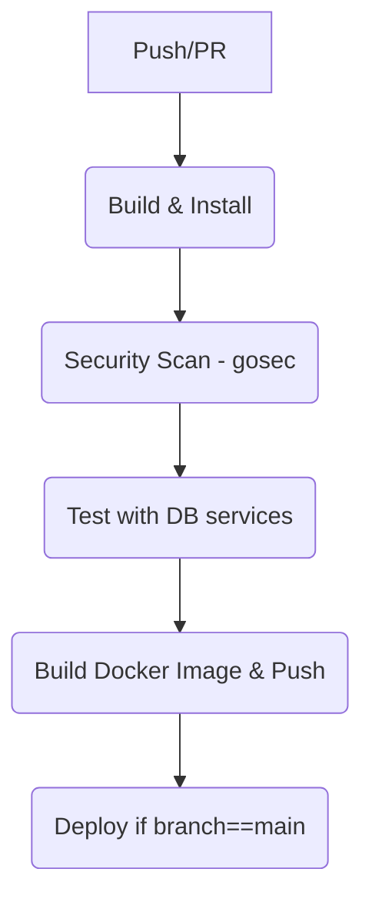

# DevOps Report

This report documents the DevOps choices, pipeline design, secret management, testing approach, and lessons learned for the `golan-mongodb-docker` project.

## 1. Technologies used

- Language: Go 1.24
- Web framework: Gin (`github.com/gin-gonic/gin`)
- Database: MongoDB (primary runtime DB) — official Go driver `go.mongodb.org/mongo-driver`
- CI: GitHub Actions
- Container tooling: Docker, Docker Buildx
- Security scanning: gosec
- Test DBs for CI: MongoDB (service container), PostgreSQL (service container) — Postgres used here for demonstration of multi-DB CI testing

## 2. Pipeline design

The pipeline is implemented as a GitHub Actions workflow (`.github/workflows/docker-publish.yml`) and contains five logical stages to meet the assignment requirement.

Mermaid diagram of the pipeline:

Stage details
- Build & Install: sets up Go, caches modules, runs `go mod download` and `go build` to validate code compiles.
- Security Scan: installs `gosec` with `go install` and runs it against the codebase to detect common security issues.
- Test (with DB services): launches MongoDB and Postgres as GitHub Actions services, sets environment variables for tests, waits for services to accept connections, and runs `go test -v ./...` which includes integration tests.
- Build Docker Image: uses `docker/setup-buildx-action` and `docker/build-push-action` to build a multi-arch image and push to Docker Hub.
- Deploy (Conditional): runs only when `github.ref == 'refs/heads/main'` and all previous stages pass. Currently a placeholder that prints the pushed image; replace with your deployment commands (SSH, Kubernetes rollout, etc.).

## 3. Secret management strategy

- Use GitHub repository secrets (Settings → Secrets and variables → Actions) to store sensitive values.
- Required secrets for the workflow:
  - `DOCKERHUB_USERNAME` — Docker Hub username or organization
  - `DOCKERHUB_TOKEN` — Docker Hub access token (prefer tokens over passwords)
- Principle: pipeline should not store plaintext credentials in the repository or print secrets to logs. Secrets are only accessed by the `docker/login-action` step and used to tag/push images.
- For deployment targets (e.g., SSH keys or kubeconfig), create separate repository secrets with restrictive names (e.g., `DEPLOY_SSH_KEY`, `KUBE_CONFIG`) and reference them only in the deploy job.

Security best practices
- Use least-privilege tokens for automation (Docker Hub access tokens with limited scope).
- Rotate tokens periodically and revoke if a secret is exposed.

## 4. Testing process

Test types in this repository:

- Unit tests: None added yet — recommended to add fast unit tests for handlers and helpers that run without external services.
- Integration tests: Added in `db_integration_test.go`. These tests:
  - Connect to MongoDB using `MONGODB_URI` and perform a small insert/find/delete on a `ci_items` collection.
  - Connect to Postgres using `POSTGRES_DSN`, create a `ci_test` table, insert a row, read it back, and cleanup.

CI behavior
- The CI `test` job spins up `mongo:6.0` and `postgres:15` as GitHub Actions services.
- Environment variables used in CI:
  - `MONGODB_URI=mongodb://mongo:27017`
  - `POSTGRES_DSN=host=postgres user=postgres password=postgres dbname=testdb sslmode=disable`
- A small wait loop verifies both service ports are reachable before running tests (to avoid flaky failures due to startup time).

Running tests locally
- You can run the integration tests locally by starting matching DB containers and exporting the variables shown in the README.

Test skipping
- Tests skip themselves when the required environment variables are missing. This keeps `go test` usable on machines where DBs are not available.

## 5. Lessons learned

- gosec install path: On GitHub runners `go install` can place binaries in `GOBIN` or in `$(go env GOPATH)/bin`. Trying to call a hard-coded path (e.g., `$GITHUB_WORKSPACE/.gobin/gosec`) caused `No such file or directory`. Fix: detect actual install location at runtime using `go env GOBIN` or fall back to `$(go env GOPATH)/bin` and execute the binary from there.

- Service health checks in workflow YAML: Using `options:` with complex quoted strings caused YAML parsing errors in the workflow file. Safer approach: expose ports and use an explicit wait loop in the job to check service readiness (e.g., `nc -z host port`). If needed, add proper YAML-escaped health options or use held images with known readiness behavior.

- Separate fast and slow tests: Keep a suite of fast unit tests to run on every PR quickly and run slower integration tests in a separate job. This speeds up feedback for code changes.

- Secrets in forked PRs: GitHub masks secrets from workflows triggered by forked PRs. If CI requires secrets for verification, use a gated process or a dedicated CI user.

## Next steps / Recommendations

- Add a suite of unit tests for handlers and small helpers to provide fast PR feedback.
- Implement a real deployment step in the `deploy` job (e.g., publish image to a registry and trigger a Kubernetes deployment or SSH into a host to update containers).
- Add version tagging (semantic-release, Git tags) and branch-aware image tagging (e.g., branch name for feature branches).
- Add vulnerability scanning for Docker images (Trivy) as an extra security stage.

## Appendix — Pipeline excerpt

Key jobs defined in `.github/workflows/docker-publish.yml`:

- `build-install` — compile check and module download
- `security-scan` — runs `gosec` (installed via `go install` and executed from `go env GOBIN` or GOPATH/bin)
- `test` — runs `go test` against services `mongo` and `postgres`
- `build-and-push` — builds multi-arch image and pushes to Docker Hub
- `deploy` — conditional `if: github.ref == 'refs/heads/main'`
